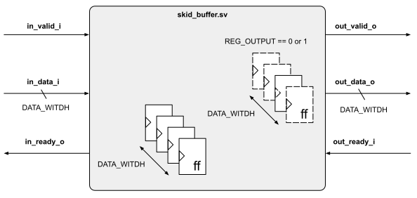

# Skid Buffer

This project is a simple skid buffer design used to break combinatorial path between two combinatorial logic clouds. Some use case / applications can be listed as (but not limited to):

1. Usually valid / data signals are FFs (seq. elements) but ready tends to be combinatorial depending on the implementation of different designs. When ready is fully combo, adding the design with REG_OUTPUT == 0 would allow the ready path to be separated by a flop helping on timing closure without adding any extra latency to the handshake.

2. If a valid/ready protocol (AXI for instance) interface needs to be routed through different tiles on an SoC, it is common to add pipeline bridges to allow the timing closure breaking the net delay through the different stages. This design allows the construction of an AXI pipeline bridge by chaining multiple skid buffers in a row.

3. Simple pipeline CPU tends to have its ready fully combo due to design complexity and performance requirements. Considering that critical path (worst slack) is likely on forwarding signals, this buffer can be added to separate different stages.

## Tests:

There is a basic [test](tests/test_basic.py) that runs 1k iterations between three type of operations:

* Continuous transfers from Master I/F to Slave I/F - wo backpressure from the slave
* Continuous transfers from Master I/F to Slave I/F - w/random backpressure from the slave
* Random transfers (not continuous) from Master I/F to Slave I/F - w/random backpressure from the slave

Also two type of design parameters are tested:

* **SMALL**: REG_OUTPUT == 0, DATA_WIDTH == 1
* **BIG**: REG_OUTPUT == 1, DATA_WIDTH == 32

*Note:* The REG_OUTPUT == 1 adds 1 clk cycle latency on all txns as obviously everything is registered.

## References:

* [ZIP CPU blog post](https://zipcpu.com/blog/2019/05/22/skidbuffer.html)
* [FPGA CPU CA](http://fpgacpu.ca/fpga/Pipeline_Skid_Buffer.html#:~:text=A%20skid%20buffer%20is%20the,smooth%2Dout%20data%20rate%20mismatches.)

